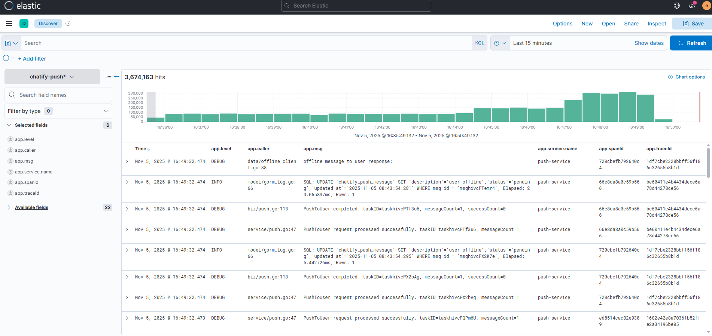
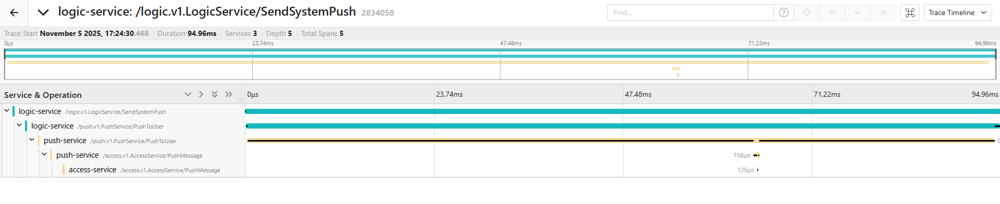
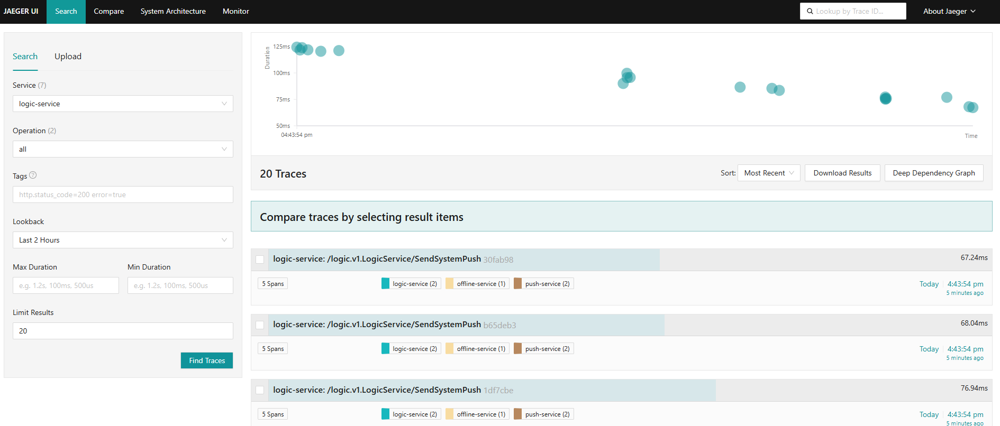
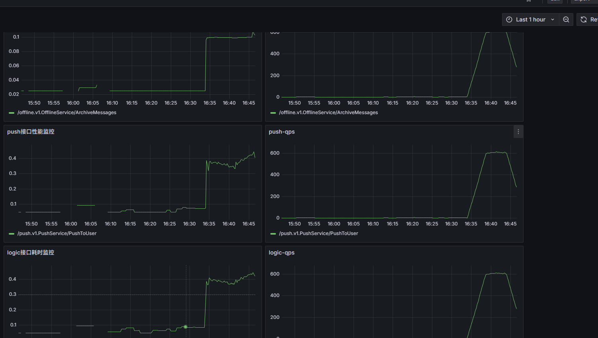
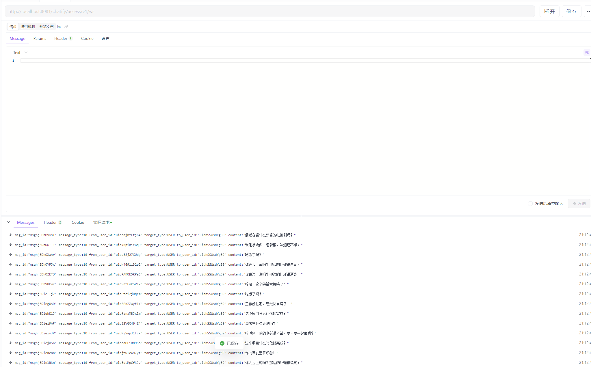
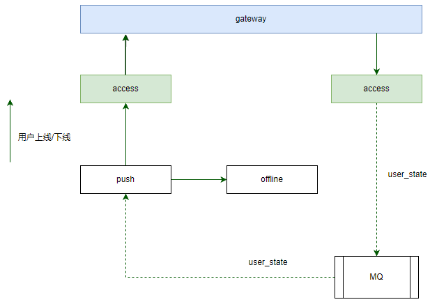

# Chatify

Chatify 是一个高并发、低延迟的即时通讯与消息推送系统，致力于让沟通变得更简单、更即时。

名称 "Chatify" 由 "Chat"（聊天）和后缀 "-ify"（表示"使...化"）组合而成，寓意"让沟通变得简单、即时"，既体现了系统的核心功能——聊天，也包含了消息通知的即时性特点。

## 功能特性

Chatify 集成了全面的监控功能：

* **日志系统**: 集成 EFK（Elasticsearch + Filebeat + Kibana）解决方案，其中 Elasticsearch 负责数据存储，Filebeat 进行数据采集，Kibana 提供数据可视化。
* **链路追踪**: 使用 Jaeger 实现请求和响应的全链路追踪，通过 Opentelemetry 协议将数据存储在 Elasticsearch 中，并通过 Jaeger 进行可视化展示。
* **指标监控**: 集成 Prometheus 和 Grafana 实现系统指标监控，并通过 Alertmanager 进行告警管理。

## 效果展示

### 1. 日志系统


### 2. 链路追踪



### 3. 指标管理


### 4. 消息通知


## 快速开始

项目采用 docker-compose 进行部署，需要预先安装 Docker 和 docker-compose。

性能测试使用 k6 工具，可以从 [GitHub 发布页面](https://github.com/grafana/k6/releases) 下载最新版本，解压即可使用。

### 部署步骤

1. 拉取代码
   ```bash
   git clone https://github.com/xinghe903/chatify.git
   ```

2. 配置环境并启动服务
   ```bash
   docker-compose up --build -d
   ```

3. 性能测试
   ```bash
   cd test
   k6 run --vus 100 --duration 10m sendSystemPush.js
   ```

**参数说明**：
* `vus`: 并发虚拟用户数
* `duration`: 压测持续时间
* `sendSystemPush.js`: 压测脚本

> 注意：系统性能会根据部署机器配置和服务实例数量动态调整。

## 系统概述

本架构设计用于构建一个高可用、可扩展、解耦的实时聊天与消息推送系统。系统支持用户间即时通信、系统通知推送、离线消息存储与补发等功能，适用于大规模在线用户场景。

各服务职责明确，支持水平扩展与独立部署。

## 核心服务组件

| 服务 | 职责 |
|------|------|
| gateway | 流量转发 |
| access | 用户连接管理，会话状态维护 |
| logic | 业务处理，内容校验 |
| push | 执行消息推送任务，判断接收方在线状态，决定是否触发离线存储 |
| offline | 离线消息存储与检索 |
| MQ | 消息队列，实现异步解耦与流量削峰 |

## 系统架构


**系统架构说明**：主要涵盖两种消息流程 - 上行消息（如用户发送消息、业务数据上报等）和下行消息（如用户接收消息、系统通知等）。

## 核心消息流程

### 1. 上行消息处理流程

1. 网关(gateway)接收用户请求，并将请求转发给 access 服务处理
2. access 服务处理用户请求后，将请求转发到消息队列 MQ（topic=chat_input）
3. logic 服务订阅 chat_input 消息，处理完成后发送给推送服务 push
4. push 服务收到消息后进行推送：离线消息发送到 offline 服务，在线消息通过 access 服务 → 网关(gateway) → 用户

### 2. 下行消息处理流程

1. logic 服务收到下行消息，处理完成后发送给推送服务 push
2. push 服务收到消息后进行推送：离线消息发送到 offline 服务，在线消息通过 access 服务 → 网关(gateway) → 用户

### 3. 用户上线后离线消息拉取



1. 用户上线/下线时，access 服务将状态变更通知发送到消息队列 MQ（topic=user_state）
2. push 服务订阅 user_state 主题，处理用户上线/下线事件
3. 如果是上线消息，push 服务从 offline 服务拉取离线消息，并通过 access 服务 → 网关(gateway) → 用户进行推送
4. 如果是下线消息，push 服务清除 Redis 中的用户连接信息

## 消息队列主题设计

| 主题（Topic） | 生产者 | 消费者 | 用途 |
|---------------|--------|--------|------|
| `chat_input` | access | logic | 用户发送的原始消息 |
| `user_state` | access | push | 用户上下线事件 |

## 关键设计机制

### 1. 连接状态管理

* 用户连接信息（用户ID、节点、连接ID）统一存储于 **Redis**
* Access 服务在用户上线时将数据写入 Redis，下线时清除相关信息
* Push 服务通过查询 Redis 判断用户在线状态，避免单点内存依赖

### 2. 离线消息可靠性保障

* **存储时机**：仅当用户不在线或推送失败时，由 Push 服务触发 offline 存储
* **删除机制**：采用"确认删除"模式，Push 成功投递后通知 Offline 服务，由 Offline 服务删除对应记录
* **防丢失机制**：启用消息队列持久化与消费确认机制

### 3. 消息去重与幂等性

* 所有消息携带唯一 `message_id`
* Push 服务使用 Redis 缓存已推送消息 ID，防止重复投递
* Logic 服务对 `chat_input` 消息做幂等处理

### 4. 高可用与容错设计

* 所有服务均为无状态设计，支持水平扩展
* 消息队列启用持久化和副本机制（如 Kafka）
* 对关键队列进行积压与延迟监控，并设置告警机制

## 部署架构

> * Redis 用于存储连接映射和去重缓存
> * 数据库用于离线消息的持久化存储
> * Push 和 Access 支持多实例部署，通过 Redis 实现状态共享

## 总结

本架构通过以下设计理念实现了高性能、高可用的聊天与推送能力：

* **职责清晰**：各服务专注单一职责，便于维护与扩展
* **易于扩展**：支持百万级并发连接，可通过增加节点实现横向扩容
* **可观测性强**：关键流程可监控，异常可追溯

该架构适用于即时通讯、社交应用、通知中心等场景，具备良好的生产落地能力。