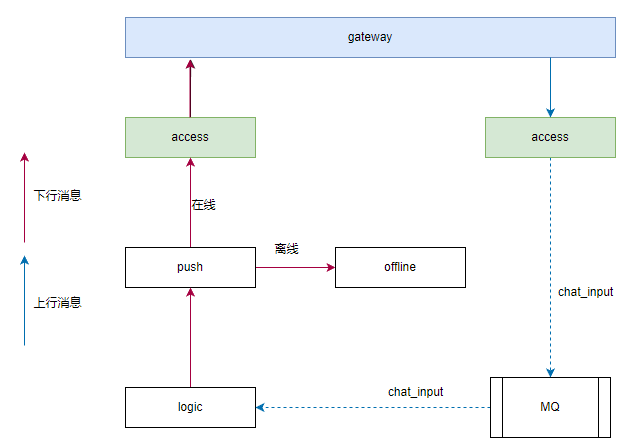
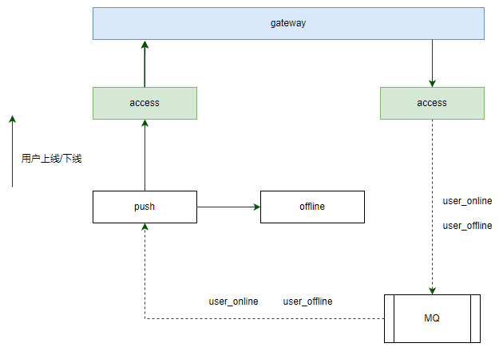

# 聊天/推送系统架构设计

## 一、系统概述

本架构设计用于构建一个高可用、可扩展、解耦的实时聊天与消息推送系统。系统支持用户间即时通信、系统通知推送、离线消息存储与补发，适用于大规模在线用户场景。

各服务职责明确，支持水平扩展与独立部署。

## 二、核心服务组件

| 服务 | 职责 |
|------|------|
|  gateway | 流量转发 |
|  access | 用户连接管理，会话状态维护 |
|  logic | 业务处理，内容校验 |
|  push | 执行消息推送任务，判断接收方在线状态，决定是否触发离线存储 |
|  offline | 离线消息存储与检索 |
|  MQ | 消息队列，实现异步解耦与流量削峰 |

## 三、整体架构图

** 系统架构图 **

> **说明** 主要介绍两种消息流程。上行消息，如用户发送消息，业务数据上报等；下行消息，如用户接收消息，系统通知等。

## 四、核心消息流程

### 1. 上行消息

* 网关gateway 接收用户请求，将请求转发给 access 服务处理。
* access 服务处理用户请求，将请求转发到消息队列 MQ(topic=chat_input)。
* logic 服务订阅 chat_input 消息，处理消息后发送给推送服务 push。
* push 服务收到消息后推送消息，将离线消息发送到offline 服务。在线消息发送到access服务=》网关gateway=》用户。

### 2. 下行消息

* logic 服务收到下行消息，处理消息后发送给推送服务 push。
* push 服务收到消息后推送消息，将离线消息发送到offline 服务。在线消息发送到access服务=》网关gateway=》用户。

### 3. 用户上线后拉取离线消息

* 用户上线、下线由 access 服务将通知发送到消息队列 MQ(topic=user_state)。
* push 服务订阅 user_state 订阅，处理用户上线、下线事件。
* 如果是上线消息，push 服务从 offline 服务拉取离线消息后发送到 access 服务=》网关 gateway =》用户。
* 如果是下线消息，push 服务清除 Redis 中用户连接信息。

## 五、消息队列主题设计

| 主题（Topic） | 生产者 | 消费者 | 用途 |
|---------------|--------|--------|------|
| `chat_input` | access | logic | 用户发送的原始消息 |
| `user_state` | access | push | 用户上下线事件 |

## 六、关键设计机制

### 1. 连接状态管理

* 用户连接信息（用户ID、节点、连接ID）统一存储于 **Redis**。
* Access 服务在用户上线时数据由 push 服务写入 Redis，下线时清除。
* Push 服务通过查询 Redis 判断用户在线状态，避免单点内存依赖。

### 2. 离线消息可靠性保障

* **存储时机**：仅当用户不在线或推送失败时，由 Push 服务触发 offline 存储。
* **删除机制**：采用“确认删除”模式，Push 成功投递后通知 Offline 服务收到后删除对应记录。
* **防丢失**：启用消息队列持久化与消费确认机制。

### 3. 消息去重与幂等

* 所有消息携带唯一 `message_id`。
* Push 服务使用 Redis 缓存已推送消息 ID，防止重复投递。
* Logic 服务对 `chat_input` 消息做幂等处理。

### 4. 高可用与容错

* 所有服务无状态，可水平扩展。
* 消息队列启用持久化、副本机制（如 Kafka）。
* 关键队列监控积压与延迟，设置告警。

## 七、部署架构示意图

> * Redis 存储连接映射、去重缓存、离线消息缓存。
> * 数据库用于离线消息持久化存储。
> * Push 和 Access 多实例部署，通过 Redis 共享状态。

## 八、总结

本架构通过以下设计实现高性能、高可用的聊天与推送能力：

* **职责清晰**：各服务专注单一职责，便于维护与扩展。
* **易于扩展**：支持千万级并发连接，可通过增加节点横向扩容。
* **可观测性强**：关键流程可监控，异常可追溯。

该架构适用于即时通讯、社交应用、通知中心等场景，具备良好的生产落地能力。

